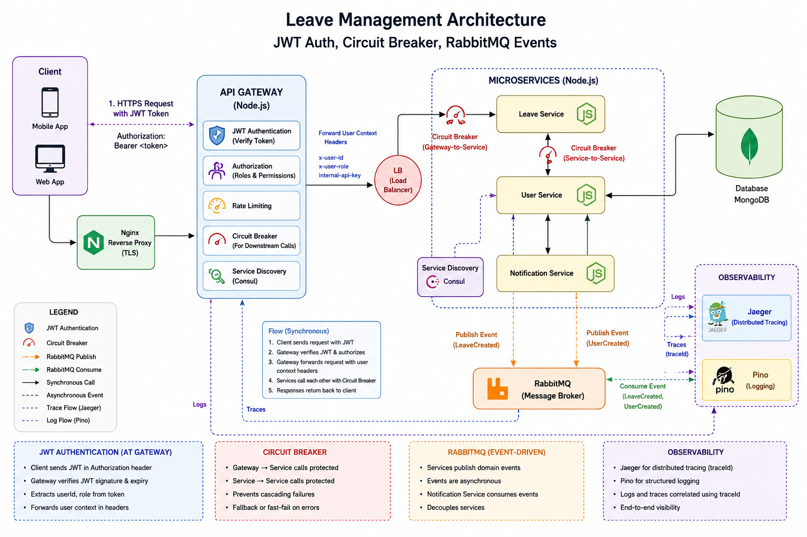

# Leave Management System

A microservices-based Leave Management System built using:

* Node.js
* TypeScript
* Express
* MongoDB
* RabbitMQ
* Consul
* OpenTelemetry
* Jaeger
* Pino
* Elasticsearch
* Kibana
* Filebeat
* Docker Compose

---

## Services

The system consists of the following services:

* API Gateway
* User Service
* Leave Service
* Notification Service
* MongoDB
* RabbitMQ
* Consul
* Jaeger
* Elasticsearch
* Kibana
* Filebeat
* Nginx

---

## Service Roles

Each service in this repository has a specific role. Start services via `docker compose` (recommended) or run individual services for local development.

- `api-gateway`: HTTP entrypoint, request routing, authentication forwarding, and proxy to backend services.
- `user-service`: manages users, authentication, and emits `UserCreated` events.
- `leave-service`: manages leave requests, balances, approvals, and consumes user events.
- `notification-service`: subscribes to events and sends/stores notifications.

---

## Resilience & Cross-cutting Features

This system includes several production-oriented features used across services:

- **Service Discovery (Consul):** Services register and discover peers via Consul for internal HTTP calls.
- **Circuit Breaker:** RPCs and RabbitMQ publishers are wrapped with a circuit-breaker to protect downstream services and provide fallbacks when necessary.
- **Rate Limiting:** Auth and public endpoints are protected by rate limit middleware to mitigate abuse.
- **Messaging (RabbitMQ):** Asynchronous workflows use RabbitMQ for event delivery (e.g., `UserCreated` → `leave-service`).
- **Distributed Tracing:** OpenTelemetry + Jaeger propagate traces across HTTP and RabbitMQ flows.
- **Logging & Observability:** `pino` structured logs are shipped via Filebeat → Elasticsearch and visualized in Kibana.

Configuration for these features is provided via each service's `.env` file and the root `docker-compose.yml`.

## Architecture Diagram


---

## Prerequisites

Install the following:

* Docker
* Docker Compose
* Git

---

## Environment Configuration

## Environment Setup

Copy all example files before starting the application:

```bash
cp .env.example .env

cp api-gateway/.env.example api-gateway/.env
cp user-service/.env.example user-service/.env
cp leave-service/.env.example leave-service/.env
cp notification-service/.env.example notification-service/.env
```

Update the values as required for your environment.

### Root Level Environment File

Create a `.env` file at the project root if required.

```text
project-root/
│
├── .env
├── docker-compose.yml
├── api-gateway/
├── user-service/
├── leave-service/
└── notification-service/
```

### Service Level Environment Files

Each service must contain its own `.env` file.

```text
api-gateway/.env
user-service/.env
leave-service/.env
notification-service/.env
```

Update all environment variables before starting the application.

---

## Shared Package

The project uses a shared library containing:

* Logger
* OpenTelemetry setup
* RabbitMQ utilities
* Service discovery helpers
* HttpClient for synchronous inter service communication


```json
{
  "dependencies": {
    "@leave/shared": "git+https://github.com/devMrRY/leave-management-shared.git"
  }
}
```

---

## Running the Application

Build and start all services:

```bash
docker compose up --build --scale api-gateway=2 --scale user-service=2 --scale leave-service=2 --scale notification-service=2
```

This command:

* Builds all service images
* Starts infrastructure services
* Creates 2 instances of:

  * API Gateway
  * User Service
  * Leave Service
  * Notification Service

---

## Service Discovery

Consul is used for:

* Service Registration
* Service Deregistration
* Health Checks
* Service Discovery

All internal HTTP communication uses Consul-based discovery.

---

## RabbitMQ Workflows

### User Creation Flow

```text
User Service
      ↓
UserCreated Event
      ↓
RabbitMQ
      ↓
Leave Service
      ↓
Initialize Leave Balance
```

### Notification Flow

```text
User Service / Leave Service
              ↓
         RabbitMQ
              ↓
    Notification Service
              ↓
Log Notification with payload
```

---

## Distributed Tracing

Tracing is implemented using:

* OpenTelemetry
* Jaeger

Trace context is propagated across:

* HTTP service-to-service calls
* RabbitMQ message flows

Access Jaeger:

```text
http://localhost:16686
```

---

## Logging & Monitoring

Logging stack:

```text
Pino
  ↓
Filebeat
  ↓
Elasticsearch
  ↓
Kibana
```

Access Kibana:

```text
http://localhost:5601
```

Access Elasticsearch:

```text
http://localhost:9200
```

---

## MongoDB Access

MongoDB is exposed on:

```text
mongodb://localhost:27018
```

### MongoDB Compass

Use:

```text
mongodb://localhost:27018
```

### Using mongosh

```bash
mongosh mongodb://localhost:27018
```

### Docker Internal Connection

Services communicate with MongoDB using:

```text
mongodb://mongo:27017
```

### Viewing Data

After connecting to MongoDB, you can inspect the databases created by:

* User Service
* Leave Service

Database names depend on the values configured in the respective `.env` files.

---

## Quick Access URLs

| Component     | URL / Connection String   |
| ------------- | ------------------------- |
| Application   | http://localhost          |
| Consul UI     | http://localhost:8500     |
| RabbitMQ UI   | http://localhost:15672    |
| Jaeger UI     | http://localhost:16686    |
| Kibana        | http://localhost:5601     |
| Elasticsearch | http://localhost:9200     |
| MongoDB       | mongodb://localhost:27018 |

---

## RabbitMQ Credentials

| Setting  | Value |
| -------- | ----- |
| Username | admin |
| Password | admin |

RabbitMQ UI:

```text
http://localhost:15672
```
---

## API Collection

Import the Postman collection from:

```text
docs/postman/Leave Management.postman_collection.json
```

Import the environment from:

```text
docs/postman/Leave Management.postman_environment.json
```
---

## Stopping the Application

```bash
docker compose down
```

Remove containers and volumes:

```bash
docker compose down -v
```